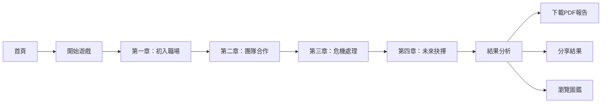

# 🎮 新語市職業適性分析系統

<div align="center">


**透過互動式遊戲探索你的職業性格！**

[🎯 線上體驗](#線上體驗) · [✨ 功能特色](#功能特色) · [🚀 快速開始](#快速開始) · [📖 技術文檔](#技術架構)

</div>

---

## 📋 專案簡介

**新語市職業適性分析系統**是一款基於 DISC 性格理論和 RIASEC 職業興趣模型的互動式網頁遊戲。玩家將扮演一位初入職場的新鮮人，在虛構的「新語市」中經歷四個章節的職場冒險，通過選擇來揭示自己的性格特質和職業傾向。

### 🎯 線上體驗

👉 [點擊這裡開始你的職業探索之旅](https://will050512.github.io/career-exploration-game/)

## ✨ 功能特色

### 🎭 沉浸式故事體驗
- **4 個章節**的完整職場故事線
- **16+ 個互動選擇**影響你的性格分析
- 精心設計的角色對話與場景描述

### 📊 科學化性格分析
- **DISC 性格測評**：主導型(D)、影響型(I)、穩定型(S)、謹慎型(C)
- **RIASEC 職業興趣**：實用、研究、藝術、社會、企業、事務
- **16 種職業人格類型**：每種都有獨特的描述和建議

### 📱 全平台響應式設計
- 手機、平板、桌面完美適配
- 觸控友好的交互設計
- 流暢的動畫過渡效果

### 📄 完整報告功能
- **PDF 報告下載**：包含完整的性格分析、優勢劣勢、職業建議
- **社交分享**：一鍵分享測驗結果
- **本地歷史記錄**：追蹤你的每次測驗

### 🏛️ 類型圖鑑收集
- 解鎖並收集所有 16 種職業人格類型
- 詳細了解每種類型的特點

## 🚀 快速開始

### 環境需求

- **Node.js** >= 18.0.0
- **npm** >= 9.0.0 或 **pnpm** >= 8.0.0

### 安裝步驟

```bash
# 克隆專案
git clone https://github.com/will050512/Occupational-aptitude-analysis-system.git
cd Occupational-aptitude-analysis-system

# 安裝依賴
npm install

# 啟動開發伺服器
npm run dev
```

開發伺服器將在 `http://localhost:5173/career-exploration-game/` 啟動。

### 建構部署

```bash
# 建構生產版本
npm run build

# 預覽建構結果
npm run preview
```

### 部署到 GitHub Pages

```bash
# 建構並部署
npm run build
# 將 dist 資料夾內容推送到 gh-pages 分支
```

## 📖 技術架構

### 前端技術棧

| 技術 | 版本 | 用途 |
|------|------|------|
| Vue.js | 3.5 | 前端框架 |
| TypeScript | 5.6 | 類型安全 |
| Vite | 7.2 | 建構工具 |
| Vue Router | 4.5 | SPA 路由 |
| jsPDF | 2.5 | PDF 生成 |
| html2canvas | 1.4 | 畫面截圖 |

### 專案結構

```
src/
├── assets/            # 靜態資源
│   └── styles/        # 全局樣式
├── components/        # 共用元件
├── data/              # 資料定義
│   ├── chapters/      # 章節故事內容
│   ├── personality-types.ts  # 人格類型定義
│   └── type-relations.ts     # 類型關聯
├── engine/            # 遊戲引擎
│   ├── StoryManager.ts       # 故事管理器
│   └── ChoiceTracker.ts      # 選擇追蹤器
├── services/          # 服務層
│   ├── StorageService.ts     # 本地儲存
│   ├── SessionService.ts     # 會話管理
│   ├── DataSubmitter.ts      # 數據提交
│   └── PdfGenerator.ts       # PDF 生成
├── utils/             # 工具函數
│   └── PersonalityAnalyzer.ts # 性格分析器
├── views/             # 頁面元件
│   ├── HomePage.vue   # 首頁
│   ├── GamePage.vue   # 遊戲頁面
│   ├── ResultPage.vue # 結果頁面
│   ├── TypeGallery.vue # 類型圖鑑
│   └── MyRecords.vue  # 歷史紀錄
├── router/            # 路由配置
├── App.vue            # 根元件
└── main.ts            # 入口文件
```

## 🎮 遊戲流程



### 章節介紹

1. **第一章：初入職場** - 你的第一天上班，如何自我介紹和處理工作？
2. **第二章：團隊合作** - 面對團隊項目，你如何與同事協作？
3. **第三章：危機處理** - 當突發狀況發生，你如何應對壓力？
4. **第四章：未來抉擇** - 站在職業的十字路口，你會做出什麼選擇？

## 📊 性格分析系統

### DISC 模型

| 類型 | 名稱 | 特徵 |
|------|------|------|
| D | 主導型 | 目標導向、果斷決策、追求結果 |
| I | 影響型 | 社交活潑、感染力強、追求認可 |
| S | 穩定型 | 穩重可靠、重視和諧、追求安全 |
| C | 謹慎型 | 分析嚴謹、追求完美、重視品質 |

### 16 種職業人格類型

系統根據 DISC 分數組合，將玩家分類為 16 種獨特的職業人格類型，每種類型都有：

- 📝 詳細的性格描述
- ✨ 優勢特點
- 🔍 成長空間
- 💼 適合的職業方向
- 💡 個人化的成長建議
- 🤝 人際互動風格

## 🛠️ 開發指南

### 本地開發

```bash
# 啟動開發伺服器（支援熱重載）
npm run dev

# 類型檢查
npm run type-check

# 程式碼檢查
npm run lint

# 建構生產版本
npm run build
```

### 新增故事章節

1. 在 `src/data/chapters/` 目錄下創建新的章節文件
2. 按照 `Chapter` 類型定義故事內容
3. 在 `src/data/chapters/index.ts` 中導出新章節

### 自訂人格類型

編輯 `src/data/personality-types.ts` 文件，按照 `PersonalityType` 介面添加新類型。

## 📦 部署選項

### GitHub Pages（推薦）

1. 在 `vite.config.ts` 中設置 `base` 為你的倉庫名稱
2. 建構專案：`npm run build`
3. 將 `dist` 資料夾部署到 `gh-pages` 分支

### Vercel / Netlify

直接連接 GitHub 倉庫，平台會自動檢測 Vite 專案並部署。

### 自託管

將 `dist` 資料夾內容部署到任何靜態文件伺服器。

## 🤝 貢獻指南

歡迎提交 Issue 和 Pull Request！

1. Fork 這個專案
2. 創建你的功能分支 (`git checkout -b feature/AmazingFeature`)
3. 提交你的更改 (`git commit -m 'Add some AmazingFeature'`)
4. 推送到分支 (`git push origin feature/AmazingFeature`)
5. 開啟一個 Pull Request

## 📄 授權條款

本專案採用 [MIT 授權條款](LICENSE)。

## 🙏 致謝

- 感謝 [Vue.js](https://vuejs.org/) 團隊提供優秀的前端框架
- 感謝 [Vite](https://vitejs.dev/) 團隊提供快速的建構工具
- DISC 性格理論由 William Moulton Marston 博士提出
- RIASEC 職業興趣模型由 John L. Holland 博士發展

---

<div align="center">

**如果這個專案對你有幫助，請給個 ⭐ Star 支持一下！**

Made with ❤️ by [will050512](https://github.com/will050512)

</div>
