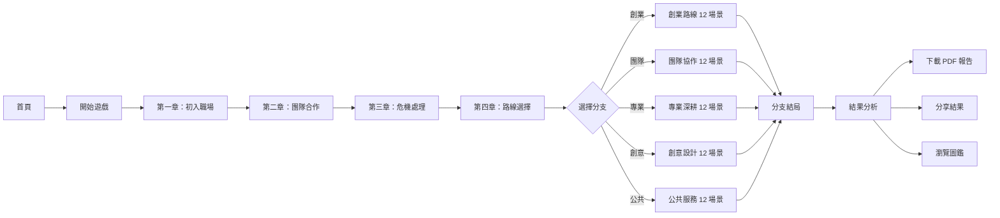

# 🎮 新語市職業適性分析系統 v2.0

<div align="center">


**透過互動式遊戲探索你的職業性格！**

[🎯 線上體驗](#線上體驗) · [✨ 功能特色](#功能特色) · [🚀 快速開始](#快速開始) · [📖 技術文檔](#技術架構)

</div>

---

## 🆕 v2.0 版本亮點

### 🌟 30 種路線組合系統
- **5 大主線分支**：創業路線 🚀、團隊協作 🤝、專業深耕 🔬、創意設計 🎨、公共服務 🏛️
- **6 種 RIASEC 變體**：每條主線都有 6 種興趣導向變體（R/I/A/S/E/C）
- **完整路線標籤**：如「創業路線-企業型」、「專業深耕-研究型」

### 📊 統一計分中心（ScoringCenter）
- 整合 DISC、RIASEC、Big Five、Career Anchors 四大理論
- 智能分支判定與 RIASEC 變體計算
- 分數校正與一致性驗證

### 🎮 增強遊戲體驗
- **進度指示器**：顯示章節/場景進度、當前分支、完成百分比
- **返回功能**：支援回到上一個選擇點重新決策
- **分支專屬色彩**：每條路線有專屬的主題色彩系統

---

## 📋 專案簡介

**新語市職業適性分析系統 v2.0**是一款基於 **DISC 性格理論**、**RIASEC 職業興趣模型**、**Big Five 人格特質**和**Career Anchors 職業錨定**的互動式網頁遊戲。玩家將扮演一位初入職場的新鮮人，在虛構的「新語市」中經歷多元的職場冒險，通過選擇來揭示自己的性格特質和職業傾向。

> 🏢 本專案由 **萬里遊科技股份有限公司** 開發維護

### 🎯 線上體驗

👉 [點擊這裡開始你的職業探索之旅](https://will050512.github.io/Occupational-aptitude-analysis-system/)

## ✨ 功能特色

### 🎭 沉浸式故事體驗

- **5 大主線分支**的完整職場故事線
- **30 種路線組合**（5 分支 × 6 RIASEC 變體）
- **16 個互動選擇**影響你的性格分析
- **分支專屬場景**：每條路線有 12 個專屬場景 + 獨特結局
- **互動題型**：排序題、滑桿題、情境選擇題
- **隨機事件系統**：增加遊戲變化性
- 精心設計的角色對話與場景描述

### 📊 四大理論科學化分析

- **DISC 性格測評**：主導型(D)、影響型(I)、穩定型(S)、謹慎型(C)
- **RIASEC 職業興趣**：實用型(R)、研究型(I)、藝術型(A)、社會型(S)、企業型(E)、事務型(C)
- **Big Five 人格特質**：開放性(O)、盡責性(C)、外向性(E)、親和性(A)、情緒穩定性(N)
- **Career Anchors 職業錨定**：8 種職涯驅動力分析
- **16 種職業人格類型**：每種都有獨特的描述和建議
- **雷達圖視覺化**：直觀展示 RIASEC 六大維度分佈

### 📱 全平台響應式設計

- 手機、平板、桌面完美適配
- 觸控友好的交互設計
- 流暢的動畫過渡效果

### 📄 完整報告功能

- **9 頁精美 PDF 報告**：
  - 封面頁（個人資訊 + 路線組合）
  - 個人特質摘要（獨特標籤 + 信心度）
  - DISC 性格分析頁
  - RIASEC 職業興趣雷達圖
  - 優勢與成長空間分析
  - 職業推薦頁
  - Big Five 人格特質分析
  - Career Anchors 職業錨定分析
  - 理論依據說明
- **社交分享**：一鍵分享測驗結果
- **本地歷史記錄**：追蹤你的每次測驗

### 🏛️ 類型圖鑑

- 瀏覽所有 16 種職業人格類型
- 依 DISC 四大類別篩選
- 詳細了解每種類型的特點、優勢與職業建議

## 🚀 快速開始

### 環境需求

- **Node.js** >= 18.0.0
- **npm** >= 9.0.0 或 **pnpm** >= 8.0.0

### 安裝步驟

```bash
# 克隆專案
git clone https://github.com/will050512/Occupational-aptitude-analysis-system.git
cd Occupational-aptitude-analysis-system

# 安裝依賴
npm install

# 啟動開發伺服器
npm run dev
```

開發伺服器將在 `http://localhost:5173/Occupational-aptitude-analysis-system/` 啟動。

### 建構部署 

```bash
# 建構生產版本
npm run build

# 預覽建構結果
npm run preview
```

### 部署到 GitHub Pages

本專案已配置 GitHub Actions 自動部署，推送到 `main` 或 `master` 分支時會自動觸發部署流程。

```yaml
# .github/workflows/deploy.yml 已包含完整部署配置
# 確保 GitHub Pages 設定：
# Settings → Pages → Source → GitHub Actions
```

## 📖 技術架構

### 前端技術棧

| 技術        | 版本 | 用途           |
| ----------- | ---- | -------------- |
| Vue.js      | 3.5  | 前端框架       |
| TypeScript  | 5.9  | 類型安全       |
| Vite        | 7.2  | 建構工具       |
| Vue Router  | 4.6  | SPA 路由（Hash 模式） |
| Tailwind CSS| 4.1  | 樣式框架       |
| Chart.js    | 4.5  | 雷達圖繪製     |
| vue-chartjs | 5.3  | Vue Chart.js 整合 |
| jsPDF       | 3.0  | PDF 生成       |
| html2canvas | 1.4  | 畫面截圖       |

### 專案結構

```
src/
├── assets/            # 靜態資源
│   └── company-logo.ts # 公司品牌資源
├── components/        # 共用元件
│   ├── HelloWorld.vue
│   ├── SplashScreen.vue
│   ├── ProgressIndicator.vue # 進度指示器（v2.0 新增）
│   ├── RankingQuestion.vue   # 排序題元件
│   ├── SliderQuestion.vue    # 滑桿題元件
│   ├── RandomEventPopup.vue  # 隨機事件彈窗
│   ├── RiasecRadarChart.vue  # RIASEC 雷達圖元件
│   └── TheoryAccordion.vue   # 理論依據手風琴元件
├── data/              # 資料定義
│   ├── branches/      # 分支路線（v2.0 核心）
│   │   ├── entrepreneur-branch.ts  # 創業路線
│   │   ├── teamwork-branch.ts      # 團隊協作路線
│   │   ├── specialist-branch.ts    # 專業深耕路線
│   │   ├── creative-branch.ts      # 創意設計路線（新增）
│   │   ├── public-branch.ts        # 公共服務路線（新增）
│   │   ├── types.ts                # 分支類型定義
│   │   └── index.ts                # 分支導出
│   ├── chapters/      # 章節故事內容
│   │   ├── chapter1.ts ~ chapter4.ts
│   │   └── index.ts
│   ├── personality-types.ts  # 16 種人格類型定義
│   ├── type-relations.ts     # 類型關聯
│   ├── riasec-types.ts       # RIASEC 六大類型定義
│   ├── random-events.ts      # 隨機事件定義
│   └── theory-sources.ts     # 理論依據學術來源
├── engine/            # 遊戲引擎
│   ├── StoryManager.ts       # 故事管理器（支援返回功能）
│   ├── ChoiceTracker.ts      # 選擇追蹤器
│   └── RandomEventManager.ts # 隨機事件管理器
├── logo/              # Logo 圖片
│   └── company-logo.png
├── services/          # 服務層
│   ├── StorageService.ts     # 本地儲存（含版本重置）
│   ├── SessionService.ts     # 會話管理
│   ├── ScoringCenter.ts      # 統一計分中心（v2.0 核心）
│   ├── DataSubmitter.ts      # 數據提交
│   └── PdfGenerator.ts       # 9 頁 PDF 報告生成
├── styles/            # 全局樣式
│   ├── animations.css
│   ├── illustrations.css
│   ├── theme.css      # 含分支專屬色彩系統
│   └── touch.css
├── utils/             # 工具函數
│   ├── PersonalityAnalyzer.ts # 性格分析器
│   └── InteractiveScoring.ts  # 互動題計分
├── views/             # 頁面元件
│   ├── HomePage.vue   # 首頁
│   ├── GamePage.vue   # 遊戲頁面（含進度指示器）
│   ├── ResultPage.vue # 結果頁面（支援 30 路線）
│   ├── TypeGallery.vue # 類型圖鑑
│   └── MyRecords.vue  # 歷史紀錄
├── router/            # 路由配置（懶載入）
├── App.vue            # 根元件
└── main.ts            # 入口文件
```

## 🎮 遊戲流程



### 5 大主線分支介紹

| 分支 | 名稱 | 描述 | 場景數 |
|------|------|------|--------|
| 🚀 | 創業路線 | 勇於開創、追求突破，建立自己的事業版圖 | 12 + 結局 |
| 🤝 | 團隊協作路線 | 重視合作、凝聚團隊，在協作中發揮價值 | 12 + 結局 |
| 🔬 | 專業深耕路線 | 專注深入、追求卓越，成為領域專家 | 12 + 結局 |
| 🎨 | 創意設計路線 | 發揮創意、設計未來，用美學改變世界 | 12 + 結局 |
| 🏛️ | 公共服務路線 | 服務大眾、貢獻社會，推動公共利益 | 12 + 結局 |

### 章節介紹

| 章節 | 名稱 | 描述 | 題數 |
|------|------|------|------|
| 第一章 | 初入職場 | 你的第一天上班，如何自我介紹和處理工作？ | 4 題 |
| 第二章 | 團隊合作 | 面對團隊項目，你如何與同事協作？ | 4 題 |
| 第三章 | 危機處理 | 當突發狀況發生，你如何應對壓力？ | 4 題 |
| 第四章 | 路線選擇 | 根據你的表現，系統推薦你進入最適合的分支路線 | 4 題 |
| 分支章節 | 專屬路線 | 深入體驗你選擇的職涯方向，面對專屬挑戰 | 12 場景 |

### 30 種路線組合

每條主線分支都有 6 種 RIASEC 變體，形成 30 種獨特的路線組合：

| 主線 | R 實作型 | I 研究型 | A 藝術型 | S 社會型 | E 企業型 | C 事務型 |
|------|---------|---------|---------|---------|---------|---------|
| 創業 | 創業-實作型 | 創業-研究型 | 創業-藝術型 | 創業-社會型 | 創業-企業型 | 創業-事務型 |
| 團隊 | 團隊-實作型 | 團隊-研究型 | 團隊-藝術型 | 團隊-社會型 | 團隊-企業型 | 團隊-事務型 |
| 專業 | 專業-實作型 | 專業-研究型 | 專業-藝術型 | 專業-社會型 | 專業-企業型 | 專業-事務型 |
| 創意 | 創意-實作型 | 創意-研究型 | 創意-藝術型 | 創意-社會型 | 創意-企業型 | 創意-事務型 |
| 公共 | 公共-實作型 | 公共-研究型 | 公共-藝術型 | 公共-社會型 | 公共-企業型 | 公共-事務型 |

## 📊 性格分析系統

### 四大理論基礎

#### DISC 模型

DISC 性格理論由心理學家 William Moulton Marston 博士於 1928 年提出，是一套廣泛應用於職場的行為風格評估工具。

| 類型 | 名稱   | 特徵                         | 顏色 |
| ---- | ------ | ---------------------------- | ---- |
| D    | 主導型 | 目標導向、果斷決策、追求結果 | 🔴 紅色 |
| I    | 影響型 | 社交活潑、感染力強、追求認可 | 🟡 黃色 |
| S    | 穩定型 | 穩重可靠、重視和諧、追求安全 | 🟢 綠色 |
| C    | 謹慎型 | 分析嚴謹、追求完美、重視品質 | 🔵 藍色 |

#### RIASEC 職業興趣模型

RIASEC 由職業心理學家 John L. Holland 博士發展，描述六種基本的職業興趣類型：

| 代碼 | 類型   | 描述                         | 適合職業 |
| ---- | ------ | ---------------------------- | -------- |
| R    | 實用型 | 喜歡操作機械、動手實作       | 工程師、技術員 |
| I    | 研究型 | 喜歡分析思考、探索問題       | 科學家、研究員 |
| A    | 藝術型 | 喜歡創意表達、美學設計       | 設計師、藝術家 |
| S    | 社會型 | 喜歡幫助他人、教育服務       | 教師、諮詢師 |
| E    | 企業型 | 喜歡領導說服、商業決策       | 經理、銷售員 |
| C    | 事務型 | 喜歡組織規劃、資料處理       | 會計師、行政人員 |

#### Big Five 人格特質（v2.0 新增）

基於 Costa & McCrae (1992) 的五因素模型：

| 維度 | 名稱 | 高分特徵 | 低分特徵 |
| ---- | ---- | -------- | -------- |
| O    | 開放性 | 富有想像力、好奇心強 | 務實、傳統 |
| C    | 盡責性 | 做事有條理、自律性強 | 較為隨性、靈活 |
| E    | 外向性 | 充滿活力、善於社交 | 偏好安靜、獨處 |
| A    | 親和性 | 善於合作、富有同理心 | 較為獨立、競爭性強 |
| N    | 情緒穩定性 | 對壓力較敏感 | 情緒穩定、冷靜 |

#### Career Anchors 職業錨定（v2.0 新增）

基於 Edgar Schein (1978, 1990) 的職業錨定理論：

| 代碼 | 類型 | 描述 |
| ---- | ---- | ---- |
| TF | 技術/功能型 | 追求專業技能精進，成為領域專家 |
| GM | 管理型 | 追求帶領團隊、做出重要決策 |
| AU | 自主型 | 追求工作獨立性和彈性 |
| SE | 安全/穩定型 | 追求工作穩定和長期保障 |
| EC | 創業型 | 追求創建自己的事業 |
| SV | 服務型 | 追求幫助他人和社會貢獻 |
| CH | 挑戰型 | 追求克服困難的成就感 |
| LS | 生活型 | 追求工作與生活平衡 |

### 16 種職業人格類型

系統根據 DISC 分數組合，將玩家分類為 16 種獨特的職業人格類型：

<details>
<summary>點擊展開完整類型列表</summary>

| 類型代碼 | 名稱 | 主要特徵 |
|---------|------|---------|
| D-Dom | 開拓者 | 高主導、高影響 |
| D-Inf | 推動者 | 高主導、均衡影響 |
| D-Ste | 執行者 | 高主導、高穩定 |
| D-Con | 策略家 | 高主導、高謹慎 |
| I-Dom | 激勵者 | 高影響、高主導 |
| I-Inf | 社交家 | 高影響、均衡穩定 |
| I-Ste | 協調者 | 高影響、高穩定 |
| I-Con | 說服者 | 高影響、高謹慎 |
| S-Dom | 支持者 | 高穩定、高主導 |
| S-Inf | 調和者 | 高穩定、高影響 |
| S-Ste | 守護者 | 高穩定、均衡謹慎 |
| S-Con | 專家 | 高穩定、高謹慎 |
| C-Dom | 分析師 | 高謹慎、高主導 |
| C-Inf | 規劃師 | 高謹慎、高影響 |
| C-Ste | 品管師 | 高謹慎、高穩定 |
| C-Con | 完美主義者 | 高謹慎、均衡穩定 |

</details>

每種類型都有：

- 📝 詳細的性格描述
- ✨ 優勢特點
- 🔍 成長空間
- 💼 適合的職業方向
- 💡 個人化的成長建議
- 🤝 人際互動風格

## 🛠️ 開發指南

### 本地開發

```bash
# 啟動開發伺服器（支援熱重載）
npm run dev

# 類型檢查並建構
npm run build

# 預覽建構結果
npm run preview
```

### 新增故事章節

1. 在 `src/data/chapters/` 目錄下創建新的章節文件
2. 按照 `Chapter` 類型定義故事內容
3. 為每個場景添加 `variants` 陣列以支援隨機變體
4. 在 `src/data/chapters/index.ts` 中導出新章節

### 新增隨機變體

```typescript
// 在場景中添加 variants 屬性
{
  id: 'scene-id',
  // ... 其他場景屬性
  variants: [
    {
      description: '變體 1 的描述...',
      dialogue: [
        { speaker: '角色', text: '變體 1 的對話' }
      ]
    },
    {
      description: '變體 2 的描述...',
      dialogue: [
        { speaker: '角色', text: '變體 2 的對話' }
      ]
    }
  ]
}
```

### 自訂人格類型

編輯 `src/data/personality-types.ts` 文件，按照 `PersonalityType` 介面添加新類型。

### PDF 報告客製化

編輯 `src/services/PdfGenerator.ts` 文件，可自訂：
- 頁面佈局與配色
- 雷達圖樣式
- 公司品牌元素

## 📦 部署選項

### GitHub Pages（推薦）

本專案已配置自動部署，使用 GitHub Actions：

1. 確保 `vite.config.ts` 中的 `base` 設為 `/Occupational-aptitude-analysis-system/`
2. 推送程式碼到 `main` 或 `master` 分支
3. GitHub Actions 會自動建構並部署
4. 在 Repository Settings → Pages 中選擇 Source 為 `GitHub Actions`

### Vercel / Netlify

直接連接 GitHub 倉庫，平台會自動檢測 Vite 專案並部署。

### 自託管

將 `dist` 資料夾內容部署到任何靜態文件伺服器。

> ⚠️ **注意**：本專案使用 Hash 模式路由（`/#/path`），適合部署到任何靜態伺服器。

## 🤝 貢獻指南

歡迎提交 Issue 和 Pull Request！

1. Fork 這個專案
2. 創建你的功能分支 (`git checkout -b feature/AmazingFeature`)
3. 提交你的更改 (`git commit -m 'Add some AmazingFeature'`)
4. 推送到分支 (`git push origin feature/AmazingFeature`)
5. 開啟一個 Pull Request

## 📄 授權條款

本專案採用 [MIT 授權條款](LICENSE)。

## 🙏 致謝

- 感謝 [Vue.js](https://vuejs.org/) 團隊提供優秀的前端框架
- 感謝 [Vite](https://vitejs.dev/) 團隊提供快速的建構工具
- 感謝 [Chart.js](https://www.chartjs.org/) 提供強大的圖表繪製功能
- 感謝 [Tailwind CSS](https://tailwindcss.com/) 提供便捷的樣式框架

### 學術理論參考

- **DISC 性格理論**：由 William Moulton Marston 博士於 1928 年在《Emotions of Normal People》一書中提出
- **RIASEC 職業興趣模型**：由 John L. Holland 博士於 1959 年發展，著作《Making Vocational Choices》為職業心理學經典
- **Big Five 人格特質**：由 Costa & McCrae 於 1992 年完善的五因素模型
- **Career Anchors 職業錨定**：由 Edgar Schein 於 1978 年提出，1990 年擴展為 8 種錨定類型

---

<div align="center">

**如果這個專案對你有幫助，請給個 ⭐ Star 支持一下！**

Made with ❤️ by [萬里遊科技股份有限公司](https://github.com/will050512)

**v2.0 版本 - 30 種路線組合系統 | 四大理論整合分析**

</div>
